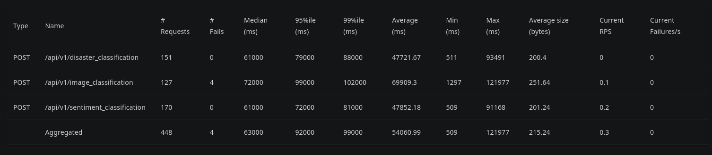

# ML REST API Load Testing Report (Locust)

This document summarizes the performance testing (load test) results using [Locust](https://locust.io/) on a deployed ML REST API located at:
    
    https://fahmiaziz-ml-model-restapi.hf.space/api/v1
    
## Testing Details
- Tool Used: Locust
- Spawn Rate: 5 users per second
- Total Users: 200

##  Server Specifications (Free from HuggingFace)

| Component     | Specification                    |
|---------------|----------------------------------|
| **CPU**       | 2 vCPU                           |
| **RAM**       | 16 GB                            |
| **Storage**   | 1 GB                             |
| **Provider**  | [HuggingFace Spaces](https://huggingface.co/spaces) (Free plan) |

> These resources are provided for free by Hugging Face and are suitable for lightweight testing, not production-grade workloads.

## Endpoints Tested

| Endpoint                         | Model Used               | Framework     | Method | Description                    |
|----------------------------------|--------------------------|---------------|--------|--------------------------------|
| `/disaster_classification`       | `TinyBERT`               |  Transformers | POST   | Classifies disaster tweets     |
| `/sentiment_classification`      | `TinyBERT`               |  Transformers | POST   | Classifies text sentiment      |
| `/image_classification`          | `ViT (vit-google)`       |  Transformers | POST   | Classifies images              |

### Summary Statistics

### RPS, Response Time & User Load Graphs

## Performance Summary Per Endpoint

#### 1. `/disaster_classification`
- **Total Requests:** 151
- **Average Response Time:** ~47 seconds
- **Median:** 61,000 ms
- **No Errors** 
- **Summary:** Stable, but response time is a bit high.

---

#### 2. `/image_classification`
- **Total Requests:** 127
- **Average Response Time:** ~69 seconds
- **95th Percentile:** up to 102,000 ms
- **Failures:** 4 requests 
- **Summary:** Heaviest endpoint due to image processing load.

---

#### 3. `/sentiment_classification`
- **Total Requests:** 170
- **Average Response Time:** ~47 seconds
- **No Errors** 
- **Summary:** Fast and stable, suitable for high traffic.

---

##  Chart Interpretation

- **Total RPS (Requests per Second):**
  - Mostly stable at 2–4 RPS
  - Peaks at 7 RPS during full load

- **Response Times:**
  - Median climbs up to ~70 seconds
  - 95th percentile reached over 120 seconds ❗

- **User Load:**
  - Peaked at **200 concurrent users**

---

## Overall Analysis

| Criteria        | Evaluation                            |
|----------------|----------------------------------------|
| **Stability**   | ✅ No crashes or mass timeouts         |
| **Performance** | ⚠️ High average response time (>40s)   |
| **Error Rate**  | ❗ ~1% (only on image classification)   |
| **Scalability** | ❌ Not yet ready for large-scale use   |

---

## Recommendations for Optimization

| Area               | Suggestion                                                                 |
|--------------------|----------------------------------------------------------------------------|
| Model Optimization | Consider lighter models (e.g., DistilBERT, ONNX format)                    |
| Model Handling     | Avoid reloading model per request; initialize once and reuse               |
| Async I/O          | Use `FastAPI + asyncio` or `httpx` for better concurrency                  |
| Architecture       | Offload inference to background workers (e.g., Celery)                     |
| Infrastructure     | Consider using GPU if model inference time is a bottleneck                 |

Detail report visit => [REPORT](report.html)

----
    Note:
    Report generated by AI